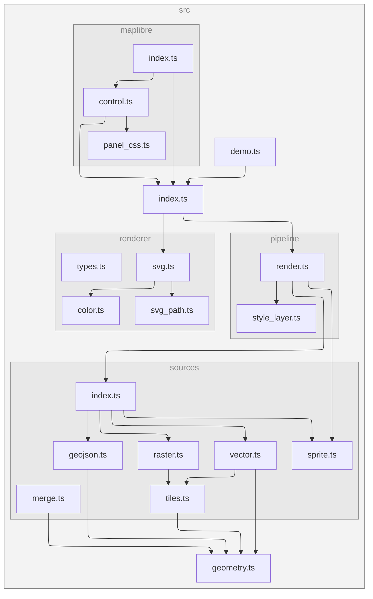

[](https://www.npmjs.com/package/@versatiles/svg-renderer)
[](https://www.npmjs.com/package/@versatiles/svg-renderer)
[](https://codecov.io/gh/versatiles-org/versatiles-svg-renderer)
[](https://github.com/versatiles-org/versatiles-svg-renderer/actions/workflows/ci.yml)
[](LICENSE)

# VersaTiles SVG Renderer

Renders vector maps as SVG.


[Download SVG](docs/demo.svg)

Supported layer types: background, fill, line, circle, symbol, and raster.

## Installation

```bash
npm install @versatiles/svg-renderer
```

## Usage

### Node.js

```typescript
import { renderToSVG } from '@versatiles/svg-renderer';
import { styles } from '@versatiles/style';
import { writeFileSync } from 'node:fs';

const svg = await renderToSVG({
	style: styles.colorful(),
	width: 800,
	height: 600,
	lon: 13.4,
	lat: 52.5,
	zoom: 10,
});

writeFileSync('map.svg', svg);
```

### Browser

```typescript
import { renderToSVG } from '@versatiles/svg-renderer';

const svg = await renderToSVG({
	style: await fetch('https://tiles.versatiles.org/assets/styles/colorful/style.json').then((r) =>
		r.json(),
	),
	width: 800,
	height: 600,
	lon: 13.4,
	lat: 52.5,
	zoom: 10,
});

document.body.innerHTML = svg;
```

### MapLibre Plugin

The package includes an `SVGExportControl` that adds an export button to any MapLibre GL JS map.

With a bundler, import it from the `/maplibre` subpath:

```typescript
import { SVGExportControl } from '@versatiles/svg-renderer/maplibre';

map.addControl(new SVGExportControl(), 'top-right');
```

Or load it directly in the browser via the UMD bundle, which exposes a `VersaTilesSVG` global:

```html
<!DOCTYPE html>
<html>
	<head>
		<link rel="stylesheet" href="https://unpkg.com/maplibre-gl@5/dist/maplibre-gl.css" />
		<script src="https://unpkg.com/maplibre-gl@5/dist/maplibre-gl.js"></script>
		<script src="https://unpkg.com/@versatiles/svg-renderer/dist/maplibre-svg-export.umd.js"></script>
	</head>
	<body>
		<div id="map"></div>
		<script>
			const map = new maplibregl.Map({
				container: 'map',
				style: 'https://tiles.versatiles.org/assets/styles/colorful/style.json',
				center: [13.4, 52.5],
				zoom: 10,
			});
			map.addControl(new VersaTilesSVG.SVGExportControl(), 'top-right');
		</script>
	</body>
</html>
```

The control opens a panel where the user can set width and height, preview the SVG, download it, or open it in a new tab. Map interactions are disabled while the panel is open.

Options:

```typescript
new SVGExportControl({
	defaultWidth: 1024, // default: 1024
	defaultHeight: 1024, // default: 1024
});
```

## API

### `renderToSVG(options): Promise<string>`

| Option         | Type                 | Default      | Description                               |
| -------------- | -------------------- | ------------ | ----------------------------------------- |
| `style`        | `StyleSpecification` | _(required)_ | MapLibre style specification              |
| `width`        | `number`             | `1024`       | Output width in pixels                    |
| `height`       | `number`             | `1024`       | Output height in pixels                   |
| `lon`          | `number`             | `0`          | Center longitude                          |
| `lat`          | `number`             | `0`          | Center latitude                           |
| `zoom`         | `number`             | `2`          | Zoom level                                |
| `renderLabels` | `boolean`            | `false`      | Enable rendering of text labels and icons |

### About `renderLabels`

When `renderLabels` is set to `true`, symbol layers are rendered, including text labels and sprite-based icons. By default, this option is disabled.

> [!WARNING]
> The rendering of labels and icons is experimental and may produce imperfect results. Since we cannot use the original layouting engine of MapLibre GL JS, there are known limitations:
>
> - **No collision detection:** Text labels are rendered without collision detection, so labels may overlap.
> - **Simplified text placement:** Labels can not be positioned along lines.

## E2E Visual Comparison

A visual comparison report between the SVG renderer and MapLibre GL JS is published to GitHub Pages:

[View Report](https://versatiles-org.github.io/versatiles-svg-renderer/report.html)

## Dependency Graph

<!--- This chapter is generated automatically --->


