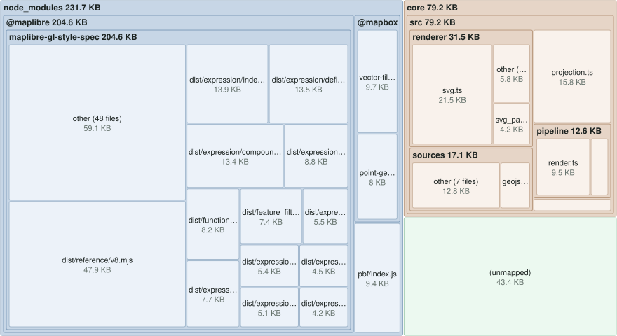

[](https://www.npmjs.com/package/@versatiles/svg-renderer)
[](https://www.npmjs.com/package/@versatiles/svg-renderer)
[](https://codecov.io/gh/versatiles-org/versatiles-svg-renderer)
[](https://github.com/versatiles-org/versatiles-svg-renderer/actions/workflows/ci.yml)
[](LICENSE)

# VersaTiles SVG Renderer

Renders MapLibre styles as SVG — in Node.js or the browser — and, in Node.js, as PNG.

**[API documentation](https://versatiles.org/versatiles-svg-renderer/doc-typescript/)** · **[Visual comparison with MapLibre](https://versatiles.org/versatiles-svg-renderer/e2e/report.html)**


[Download SVG](docs/demo.svg)

Supported layer types: background, fill, line, circle, symbol, and raster.

## Installation

```bash
npm install @versatiles/svg-renderer
```

## Usage

### Node.js

```typescript
import { renderToSVG } from '@versatiles/svg-renderer';
import { inlineSources, osm } from '@versatiles/style';
import { writeFile } from 'node:fs/promises';

// inlineSources() resolves the style's TileJSON sources into tile URLs.
const style = await osm({ theme: 'colorful' });

const svg = await renderToSVG({
	style,
	width: 800,
	height: 600,
	lon: 13.4,
	lat: 52.5,
	zoom: 10,
});

await writeFile('map.svg', svg);
```

> [!IMPORTANT]
> The style's sources must list their tile URLs directly (`"tiles": [...]`). A source that only points at a TileJSON document (`"url": ".../tiles.json"`) is **not fetched, and the map comes out empty without an error**. Styles built with `@versatiles/style` are in that form, so pass them through its `inlineSources()` as above. Hosted style files usually list their tiles already.

### Browser

```typescript
import { renderToSVG } from '@versatiles/svg-renderer';

const svg = await renderToSVG({
	style: await fetch('https://tiles.versatiles.org/assets/styles/colorful/style.json').then((r) =>
		r.json(),
	),
	width: 800,
	height: 600,
	lon: 13.4,
	lat: 52.5,
	zoom: 10,
});

document.body.innerHTML = svg;
```

### PNG (Node.js)

`renderToPNG` takes the same options and draws the same map, straight to a PNG — no browser or SVG rasterizer involved. It needs the native canvas backend [`@napi-rs/canvas`](https://www.npmjs.com/package/@napi-rs/canvas), an optional peer dependency:

```bash
npm install @versatiles/svg-renderer @napi-rs/canvas
```

```typescript
import { renderToPNG } from '@versatiles/svg-renderer/png';
import { inlineSources, osm } from '@versatiles/style';
import { writeFile } from 'node:fs/promises';

const style = await osm({ theme: 'colorful' });

const png = await renderToPNG({
	style,
	width: 800,
	height: 600,
	lon: 13.4,
	lat: 52.5,
	zoom: 10,
	scale: 2, // 1600 × 1200 pixels
});

await writeFile('map.png', png);
```

Without `@napi-rs/canvas` installed, `renderToPNG` throws an error explaining what to install; the rest of the package works without it.

### MapLibre Plugin

The package includes an `SVGExportControl` that adds an export button to any MapLibre GL JS map.

With a bundler, import it from the `/maplibre` subpath:

```typescript
import { SVGExportControl } from '@versatiles/svg-renderer/maplibre';

map.addControl(new SVGExportControl(), 'top-right');
```

Or load it directly in the browser via the UMD bundle, which exposes a `VersaTilesSVG` global:

```html
<!DOCTYPE html>
<html>
	<head>
		<link rel="stylesheet" href="https://unpkg.com/maplibre-gl@5/dist/maplibre-gl.css" />
		<script src="https://unpkg.com/maplibre-gl@5/dist/maplibre-gl.js"></script>
		<script src="https://unpkg.com/@versatiles/svg-renderer/dist/maplibre-svg-export.umd.js"></script>
	</head>
	<body>
		<div id="map"></div>
		<script>
			const map = new maplibregl.Map({
				container: 'map',
				style: 'https://tiles.versatiles.org/assets/styles/colorful/style.json',
				center: [13.4, 52.5],
				zoom: 10,
			});
			map.addControl(new VersaTilesSVG.SVGExportControl(), 'top-right');
		</script>
	</body>
</html>
```

The control opens a panel where the user can set width and height, preview the SVG, download it, or open it in a new tab. Map interactions are disabled while the panel is open.

Options:

```typescript
new SVGExportControl({
	defaultWidth: 1920, // default: the width of the map's container
	defaultHeight: 1080, // default: the height of the map's container
});
```

## API

### `renderToSVG(options): Promise<string>`

| Option         | Type                 | Default      | Description                               |
| -------------- | -------------------- | ------------ | ----------------------------------------- |
| `style`        | `StyleSpecification` | _(required)_ | MapLibre style specification              |
| `width`        | `number`             | `1024`       | Output width in pixels                    |
| `height`       | `number`             | `1024`       | Output height in pixels                   |
| `lon`          | `number`             | `0`          | Center longitude                          |
| `lat`          | `number`             | `0`          | Center latitude                           |
| `zoom`         | `number`             | `2`          | Zoom level                                |
| `renderLabels` | `boolean`            | `false`      | Enable rendering of text labels and icons |

### `renderToPNG(options): Promise<Uint8Array>`

Imported from `@versatiles/svg-renderer/png`. Node.js only; requires `@napi-rs/canvas`. Takes every option of `renderToSVG`, plus:

| Option  | Type                     | Default | Description                                                                                          |
| ------- | ------------------------ | ------- | ---------------------------------------------------------------------------------------------------- |
| `scale` | `number`                 | `1`     | Pixel density: the image is `width × scale` by `height × scale` pixels. Use `2` for sharp output.    |
| `fonts` | `Record<string, string>` | —       | Font files for labels, by the `text-font` name the style uses: `{ noto_sans_regular: 'path.woff2' }` |

The result is typed as a `Uint8Array` so the package does not require Node's type definitions; at runtime it is a `Buffer` and can be written with `fs.writeFile` as is.

### About `renderLabels`

When `renderLabels` is set to `true`, symbol layers are rendered, including text labels and sprite-based icons. By default, this option is disabled.

> [!WARNING]
> The rendering of labels and icons is experimental and may produce imperfect results. Since we cannot use the original layouting engine of MapLibre GL JS, there are known limitations:
>
> - **No collision detection:** Text labels are rendered without collision detection, so labels may overlap.
> - **Simplified text placement:** Labels can not be positioned along lines.

### Projections

The renderer follows the style's [`projection`](https://maplibre.org/maplibre-style-spec/projection/): `mercator` (the default), `vertical-perspective` and `globe`, which — like in MapLibre GL JS — shows the globe up to zoom 11 and blends into mercator between zoom 11 and 12. Zoom-dependent `step`/`interpolate` expressions are supported as well. On the globe, geometry is clipped at the horizon and the map is clipped to the globe's outline; everything outside of it stays transparent. Raster tiles are drawn as a mesh of small triangles, each mapped exactly onto the globe by its own affine transform.

## E2E Visual Comparison

A visual comparison report between the SVG renderer and MapLibre GL JS is published to GitHub Pages:

[View Report](https://versatiles.org/versatiles-svg-renderer/e2e/report.html)

## Bundle Composition

<!--- This chapter is generated automatically --->

[](docs/bundle-treemap.svg?raw=true)

Sized by the bundle's own source map: **354.4 KB** raw, **74.8 KB** gzipped, across 82 modules.

## Dependency Graph

<!--- This chapter is generated automatically --->

[](docs/dependency-graph.svg?raw=true)
