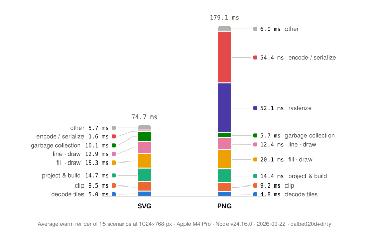

[](https://github.com/versatiles-org/versatiles-svg-renderer/actions/workflows/ci.yml)
[](https://codecov.io/gh/versatiles-org/versatiles-svg-renderer)
[](LICENSE)

# VersaTiles SVG Renderer

Renders MapLibre styles as SVG in Node.js or the browser, and as PNG in Node.js. It also comes as a MapLibre GL JS control that exports the current map view as SVG.

**[API documentation](https://versatiles.org/versatiles-svg-renderer/doc-typescript/)** · **[Visual comparison with MapLibre](https://versatiles.org/versatiles-svg-renderer/e2e/report.html)** · **[Plugin demo](https://versatiles.org/versatiles-svg-renderer/demo/index.html)**


[Download SVG](docs/demo.svg)

Supported layer types: background, fill, line, circle, symbol, and raster.

## Which package do I need?

| You want to …                                       | Package                                                                     | Runs in           |
| --------------------------------------------------- | --------------------------------------------------------------------------- | ----------------- |
| render maps as **SVG**                              | [`@versatiles/svg-renderer`](packages/svg-renderer/README.md)               | Node.js, browsers |
| render maps as **PNG** (and SVG)                    | [`@versatiles/png-renderer`](packages/png-renderer/README.md)               | Node.js           |
| add an **"export as SVG" button** to a MapLibre map | [`@versatiles/maplibre-svg-export`](packages/maplibre-svg-export/README.md) | browsers          |

All three share one renderer and are released together under the same version number.

### SVG, in Node.js or the browser

[](https://www.npmjs.com/package/@versatiles/svg-renderer)

```bash
npm install @versatiles/svg-renderer
```

```typescript
import { renderToSVG } from '@versatiles/svg-renderer';

const url = 'https://tiles.versatiles.org/assets/styles/colorful/style.json';
const style = await (await fetch(url)).json();
const svg = await renderToSVG({ style, lon: 13.4, lat: 52.5, zoom: 10 });
```

To render many views of one style, use `SVGMapRenderer`: it parses the style once and keeps the tiles and sprite between renders.

```typescript
import { SVGMapRenderer } from '@versatiles/svg-renderer';

const map = new SVGMapRenderer({ style });
const svg = await map.renderSVG({ lon: 13.4, lat: 52.5, zoom: 10 });
```

No native code; its only dependency is a types package. [Full documentation](packages/svg-renderer/README.md)

### PNG (and SVG), in Node.js

[](https://www.npmjs.com/package/@versatiles/png-renderer)

```bash
npm install @versatiles/png-renderer
```

```typescript
import { renderToPNG } from '@versatiles/png-renderer';

const png = await renderToPNG({ style, lon: 13.4, lat: 52.5, zoom: 10 });
```

For many views of one style, `PNGMapRenderer` works like `SVGMapRenderer` and renders both PNG and SVG. Draws with [`@napi-rs/canvas`](https://www.npmjs.com/package/@napi-rs/canvas), which npm installs with it, including the native binary for your platform. [Full documentation](packages/png-renderer/README.md)

### MapLibre plugin, in the browser

[](https://www.npmjs.com/package/@versatiles/maplibre-svg-export)

```html
<script src="https://cdn.jsdelivr.net/npm/@versatiles/maplibre-svg-export@2"></script>
<script>
	map.addControl(new VersaTilesSVG.SVGExportControl(), 'top-right');
</script>
```

Also available from npm for bundlers, and as a download from the [GitHub releases](https://github.com/versatiles-org/versatiles-svg-renderer/releases/latest). [Full documentation](packages/maplibre-svg-export/README.md)

## Upgrading from 1.x

Version 2.0.0 split the single package into the three above. See the [migration guide in the CHANGELOG](CHANGELOG.md#migrating-from-1x).

## E2E Visual Comparison

A visual comparison report between this renderer and MapLibre GL JS is published to GitHub Pages:

[View Report](https://versatiles.org/versatiles-svg-renderer/e2e/report.html)

## Performance

How long a warm render takes, divided into its steps: the average over the vector and satellite scenarios of the visual comparison, rendered at 1024 × 768 px by an `SVGMapRenderer` or `PNGMapRenderer` that has rendered the view before, so every cache hits. The PNG output is split by an estimate: the canvas only draws its pixels when the image is encoded.



The numbers depend on the machine, so the chart names it. `npm run bench` measures again and redraws the chart.

## Development

This repository is an npm workspace:

| Path                                                                     | What                                                                               |
| ------------------------------------------------------------------------ | ---------------------------------------------------------------------------------- |
| [`packages/core`](packages/core/README.md)                               | the renderer, shared by all packages (private, bundled into each, never published) |
| [`packages/svg-renderer`](packages/svg-renderer/README.md)               | `@versatiles/svg-renderer`                                                         |
| [`packages/png-renderer`](packages/png-renderer/README.md)               | `@versatiles/png-renderer`                                                         |
| [`packages/maplibre-svg-export`](packages/maplibre-svg-export/README.md) | `@versatiles/maplibre-svg-export`                                                  |
| `e2e`, `bench`, `dev`, `demo`, `scripts`                                 | end-to-end tests, benchmarks, dev server, plugin demo, build and release scripts   |

Each package's README shows its dependency graph; the plugin's also shows the composition of its browser bundle. The [graph of the whole workspace](#dependency-graph) is at the end of this README.

| Command             | Does                                                                                                                                                                                 |
| ------------------- | ------------------------------------------------------------------------------------------------------------------------------------------------------------------------------------ |
| `npm run build`     | builds every package into `packages/*/dist/`                                                                                                                                         |
| `npm test`          | unit tests                                                                                                                                                                           |
| `npm run test:pack` | packs every package and uses it from a clean project (`-- --docker` adds Linux checks)                                                                                               |
| `npm run test:e2e`  | visual comparison with MapLibre GL JS, and the plugin in a real browser                                                                                                              |
| `npm run check`     | format, lint, typecheck, build and all tests                                                                                                                                         |
| `npm run bench`     | measures warm render times, SVG and PNG, and how they divide into the steps of a render, then redraws `docs/benchmark.svg`; `-- --json <file>` saves, `-- --compare <file>` compares |
| `npm run profile`   | writes a CPU profile of one scenario to `bench/output/`, e.g. `npm run profile -- berlin-vector --case png-warm`                                                                     |
| `npm run dev`       | dev server for the plugin at <http://localhost:3000/>, rebuilding on change                                                                                                          |
| `npm run docs`      | builds, then regenerates the graphics and generated sections of the package READMEs and of this one (commit the result)                                                              |

## Releasing

All packages are released together, with one version number, by a GitHub workflow.

1. Describe the changes under `## [Unreleased]` in [CHANGELOG.md](CHANGELOG.md), and make sure CI is green on `main`.
2. Run `npm run release <patch|minor|major|x.y.z>` on an up-to-date `main`. Use a version like `2.1.0-rc.0` for a prerelease (published with the npm dist-tag `next`), and add `-- --dry-run` to only see what would happen. The script sets the version in every `package.json`, dates the changelog section, then commits, tags and pushes.
3. The tag starts the [Release workflow](https://github.com/versatiles-org/versatiles-svg-renderer/actions/workflows/release.yml). It verifies the tag, builds, tests and packs everything, then waits for a maintainer to **approve the `npm` environment**. After approval it publishes to npm (with provenance) and creates the GitHub release with `maplibre-svg-export.tar.gz`.

If the workflow fails, fix the cause and use "Re-run failed jobs": versions already on npm are skipped. Never move or delete a release tag; fix mistakes in the next version.

<details>
<summary>One-time setup of GitHub and npm</summary>

- **npm**, for each of the three packages: _Settings → Trusted publishing → GitHub Actions_ with repository `versatiles-org/versatiles-svg-renderer`, workflow `release.yml`, environment `npm` and the **publish** permission (`npm trust list <package>` shows it). Then _Settings → Publishing access → "Require two-factor authentication and disallow tokens"_. A package must exist before it can be configured, so publish a new package name once by hand first.
- **GitHub**: an environment named `npm`, limited to tags matching `v*`, with the maintainers as required reviewers. A tag ruleset for `v*` that restricts creating, updating and deleting release tags.

</details>

## Dependency Graph

<!--- This chapter is generated automatically --->

[](docs/dependency-graph.svg?raw=true)

## MapLibre GL JS Coverage

What MapLibre GL JS can do, and how far the SVG and PNG renderers follow it. Unsupported features are reported through the `onWarning` option. All gaps carry the label [`maplibre-parity`][parity].

✅ supported · ⚠️ partly · ❌ not yet

| Feature                               | SVG | PNG | Issue |
| ------------------------------------- | :-: | :-: | ----- |
| **Camera**                            |     |     |       |
| Mercator, globe, vertical-perspective | ✅  | ✅  |       |
| Bearing (rotation)                    | ❌  | ❌  | [#35] |
| Pitch (tilt)                          | ❌  | ❌  | [#37] |
| Padding                               | ❌  | ❌  | [#57] |
| Default view from the style           | ✅  | ✅  |       |
| 3D terrain                            | ❌  | ❌  | [#48] |
| Sky, fog, light                       | ❌  | ❌  | [#49] |
| **Sources**                           |     |     |       |
| Vector and raster tiles               | ✅  | ✅  |       |
| GeoJSON, inline or from a URL         | ✅  | ✅  |       |
| TileJSON (source `url`)               | ✅  | ✅  |       |
| `scheme`, `bounds`, `minzoom`         | ✅  | ✅  |       |
| Several URLs in `tiles`               | ✅  | ✅  |       |
| `image` and `video` sources           | ❌  | ❌  | [#51] |
| GeoJSON clustering                    | ❌  | ❌  | [#52] |
| `raster-dem`                          | ❌  | ❌  | [#47] |
| **Layers**                            |     |     |       |
| `background`, `fill`, `line`          | ✅  | ✅  |       |
| `circle`, `raster`                    | ✅  | ✅  |       |
| `symbol`                              | ⚠️  | ⚠️  | ↓     |
| `fill-extrusion`                      | ❌  | ❌  | [#45] |
| `heatmap`                             | ❌  | ❌  | [#46] |
| `hillshade`, `color-relief`           | ❌  | ❌  | [#47] |
| Patterns (`*-pattern`)                | ❌  | ❌  | [#44] |
| `line-gap-width`, `line-gradient`     | ❌  | ❌  | [#53] |
| Other paint/layout properties         | ⚠️  | ⚠️  | [#54] |
| **Labels and icons**                  |     |     |       |
| Icons from the sprite, SDF icons      | ✅  | ✅  |       |
| Point labels                          | ✅  | ✅  |       |
| Style's fonts                         | ⚠️¹ | ✅² | [#43] |
| Dropping overlaps                     | ❌  | ❌  | [#38] |
| Labels along lines                    | ❌  | ❌  | [#39] |
| Label position in polygons            | ⚠️  | ⚠️  | [#40] |
| Line breaks, wrapping                 | ❌  | ❌  | [#41] |
| `format` expressions                  | ⚠️³ | ⚠️³ | [#42] |
| **Expressions**                       |     |     |       |
| Filters, zoom expressions             | ✅  | ✅  |       |
| `global-state`                        | ❌  | ❌  | [#55] |

¹ The SVG names the font; the viewer has to provide it.
² With the `fonts` option; otherwise installed fonts.
³ The text is drawn, its formatting is lost.

Labels and icons are only drawn with `renderLabels: true`. Interaction, animation and `feature-state` do not apply to a static image.

[parity]: https://github.com/versatiles-org/versatiles-svg-renderer/issues?q=is%3Aopen+label%3Amaplibre-parity
[#35]: https://github.com/versatiles-org/versatiles-svg-renderer/issues/35
[#37]: https://github.com/versatiles-org/versatiles-svg-renderer/issues/37
[#38]: https://github.com/versatiles-org/versatiles-svg-renderer/issues/38
[#39]: https://github.com/versatiles-org/versatiles-svg-renderer/issues/39
[#40]: https://github.com/versatiles-org/versatiles-svg-renderer/issues/40
[#41]: https://github.com/versatiles-org/versatiles-svg-renderer/issues/41
[#42]: https://github.com/versatiles-org/versatiles-svg-renderer/issues/42
[#43]: https://github.com/versatiles-org/versatiles-svg-renderer/issues/43
[#44]: https://github.com/versatiles-org/versatiles-svg-renderer/issues/44
[#45]: https://github.com/versatiles-org/versatiles-svg-renderer/issues/45
[#46]: https://github.com/versatiles-org/versatiles-svg-renderer/issues/46
[#47]: https://github.com/versatiles-org/versatiles-svg-renderer/issues/47
[#48]: https://github.com/versatiles-org/versatiles-svg-renderer/issues/48
[#49]: https://github.com/versatiles-org/versatiles-svg-renderer/issues/49
[#51]: https://github.com/versatiles-org/versatiles-svg-renderer/issues/51
[#52]: https://github.com/versatiles-org/versatiles-svg-renderer/issues/52
[#53]: https://github.com/versatiles-org/versatiles-svg-renderer/issues/53
[#54]: https://github.com/versatiles-org/versatiles-svg-renderer/issues/54
[#55]: https://github.com/versatiles-org/versatiles-svg-renderer/issues/55
[#57]: https://github.com/versatiles-org/versatiles-svg-renderer/issues/57
