# @versatiles/renderer-core

The renderer shared by [`@versatiles/svg-renderer`](../svg-renderer/README.md), [`@versatiles/png-renderer`](../png-renderer/README.md) and [`@versatiles/maplibre-svg-export`](../maplibre-svg-export/README.md). It is private: never published, each of those packages bundles it.

| Path              | What                                                                                               |
| ----------------- | -------------------------------------------------------------------------------------------------- |
| `map_renderer.ts` | `SVGMapRenderer`: parses a style once and keeps the sprite and tiles between renders               |
| `render_svg.ts`   | `renderToSVG`, rendering a single view                                                             |
| `pipeline/`       | the render loop over the style's layers, and the evaluation of their paint and layout values       |
| `sources/`        | loading vector, raster and GeoJSON sources, sprites, and the tile cache                            |
| `renderer/`       | the drawing backends: `SVGRenderer`, and `CanvasRenderer` for PNG (via `@versatiles/png-renderer`) |
| `projection.ts`   | Mercator and globe projections                                                                     |
| `geometry.ts`     | points and features in screen coordinates                                                          |
| `lru_cache.ts`    | the size-bounded cache behind the tile and image caches                                            |

## Dependency Graph

<!--- This chapter is generated automatically --->

## License

MIT. Part of [VersaTiles](https://github.com/versatiles-org/versatiles-svg-renderer).
